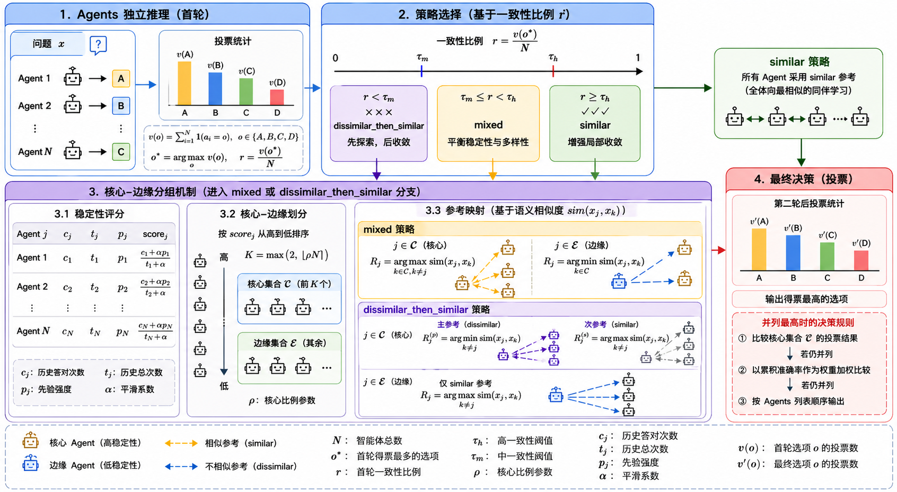

# PruneComm-HS

PruneComm-HS 是一个面向多智能体协作的实验项目，核心目标是在尽量保持准确率的前提下，降低通信过程中的 Token 开销，并分析不同通信策略、模型组合与协作方式带来的影响。

## 整体架构图



## 演示 GIF


## 项目特点

- 支持多 Agent 协作推理与两轮通信流程。
- 支持 `similar`、`dissimilar`、`random` 和 `hybrid` 等通信策略。
- 记录每轮实验的 JSON、CSV、日志和可视化图表，便于后续分析。
- 提供前端页面与后端历史查询接口，用于浏览实验结果。

## 目录结构

- `PruneComm/system/exp.py`：实验主流程，负责运行多智能体协作、统计指标和生成图表。
- `server.py`：实验历史 API，扫描 `exp/result_*` 下的结果并提供查询。
- `frontend/`：Next.js 前端，用于展示实验历史和结果页面。
- `exp/`：实验输出目录，包含每次运行生成的结果文件。
- `model.env`：实验环境变量配置示例。

## 环境要求

- Python 3.10+
- Node.js 18+（如果需要运行前端）
- 可访问的 OpenAI 兼容接口或对应模型服务

## 安装

### 1. 后端依赖

在项目根目录执行：

```powershell
pip install -r requirements.txt
```

### 2. 配置环境变量

参考 `model.env`，至少确认以下变量可用：

- `BASE_URL`
- `API_KEY`
- `NUMS_AGENTS`
- `MAX_ROUNDS`
- `COMM_MODE`
- `LLM_NAME_LIST`

如果你想先快速跑一组实验，可以直接修改 `model.env`，让它和当前实验配置保持一致。

## 运行实验

在项目根目录执行：

```powershell
python .\PruneComm\system\exp.py
```

运行后会在 `exp/result_时间戳/通信模式/` 下生成：

- `round_json/`：逐轮实验记录
- `metrics/`：汇总指标与图表
- `trace_*.json`：完整轨迹
- `log_*.txt`：运行日志

## 运行后端 API

后端用于读取历史实验结果：

```powershell
uvicorn server:app --reload
```

默认会扫描 `exp/` 目录下的实验结果。

## 运行前端

进入前端目录并启动开发服务器：

```powershell
cd .\frontend
npm install
npm run dev
```

前端默认会通过环境变量 `NEXT_PUBLIC_API_BASE_URL` 访问后端；如果未配置，通常会回退到 `http://127.0.0.1:8000`。

## 常见注意事项

- 不要把 `model.env`、密钥和本地实验缓存直接提交到仓库。
- 如果 `frontend` 目录曾经是独立 Git 仓库，需要先移除其中的 `.git` 目录，再作为普通子目录提交。
- Windows 下如果出现换行符警告，一般不影响运行。

## 参考说明

项目的实验设计、模型分组与 54 组实验清单可以参考：

- `Exp.md`
- `Runbook_54_Experiments.md`
